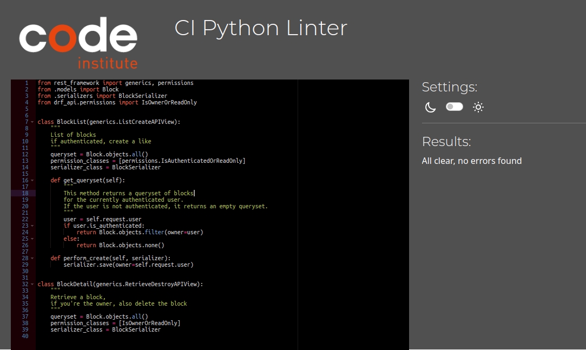

# Table of Contents
* [Validator Testing](#validator-testing)
  * [Python](#python)
* [Manual Testing](#manual-testing)
* [DRF API](#drf-api)
* [Profiles](#profiles)
* [Posts](#posts)
* [Comments](#comments)
* [Followers](#followers)

## Validator Testing

### Python

All Python files were run validated with pep8 and cleaned until no errors were found.

Python validation results

## Manual Testing

### DRF API
| Feature | Action | Expected Outcome | Pass/Fail |
| --- | --- | --- | --- |
| Refresh token | POST | Refreshes the auth token to keep the user signed in | Pass |
| Sign-out view | POST | Destroys the token and signs the user out | Pass |

### Profiles
| Feature | Action | Expected Outcome | Pass/Fail |
| --- | --- | --- | --- |
| Profile List | GET | Show a list of all profiles as JSON objects | Pass |
| Profile List | POST | Create a new profile if valid | Pass |
| Profile List | POST | Automatically make a profile when creating a user | Pass |
| Profile Detail | GET | Return a specific profile if given a valid id | Pass |
| Profile Detail | POST | Create a new | Pass |
| Profile Detail | PUT | Update the profile if valid | Pass |
| Profile Detail | DELETE | Destroy the profile and its owner instance if valid | Pass |
| Related instances | DELETE | Destroying a profile destroys all content related to its owner | Pass |
| Serializer | Annotation | Annotate the number of posts, followers, and followed users of a profile | Pass |

### Posts
| Feature | Action | Expected Outcome | Pass/Fail |
| --- | --- | --- | --- |
| Post List | GET | Show a list of all posts as JSON objects | Pass |
| Post List | POST | Create a new post if valid | Pass |
| Post Detail | GET | Return a specific post if given a valid id | Pass |
| Post Detail | POST | Create a new post if valid | Pass |
| Post Detail | PUT | Update the post if valid | Pass |
| Post Detail | DELETE | Destroy the post instance if valid | Pass |
| Validators | Check file size | Validator rejects files that are too large | Pass |

### Comments
| Feature | Action | Expected Outcome | Pass/Fail |
| --- | --- | --- | --- |
| Comment List | GET | Show a list of all comments as JSON objects | Pass |
| Comment List | POST | Create a new comment if valid | Pass |
| Comment Detail | GET | Return a specific comment if given a valid id | Pass |
| Comment Detail | POST | Create a new comment if valid | Pass |
| Comment Detail | PUT | Update the comment if valid | Pass |
| Comment Detail | DELETE | Destroy the comment if valid | Pass |

### Followers
| Feature | Action | Expected Outcome | Pass/Fail |
| --- | --- | --- | --- |
| Follower List | GET | Show a list of all followers as JSON objects | Pass |
| Follower List | POST | Create a new follower if valid | Pass |
| Follower Detail | GET | Return a specific follower if given a valid id | Pass |
| Follower Detail | POST | Create a new follower if valid | Pass |
| Follower Detail | PUT | Update the follower if valid | Pass |
| Follower Detail | DELETE | Destroy the follower if valid | Pass |
| Unique Together | No duplicates | The model prevents creating duplicate follow instances with the same owner and target user | Pass |

### Likes
| Feature | Action | Expected Outcome | Pass/Fail |
| --- | --- | --- | --- |
| Like List | GET | Show a list of all likes as JSON objects | Pass |
| Like List | POST | Create a new like if valid | Pass |
| Like Detail | GET | Return a specific like if given a valid id | Pass |
| Like Detail | POST | Create a new like if valid | Pass |
| Like Detail | PUT | Update the like if valid | Pass |
| Like Detail | DELETE | Destroy the like if valid | Pass |
| Unique Together | No duplicates | The model prevents creating duplicate like instances with the same owner and target post | Pass |

### Friends
| Feature | Action | Expected Outcome | Pass/Fail |
| --- | --- | --- | --- |
| Friend List | GET | Show a list of all friends as JSON objects | Pass |
| Friend List | POST | Create a new friend if valid | Pass |
| Friend Detail | GET | Return a specific friend if given a valid id | Pass |
| Friend Detail | POST | Create a new friend if valid | Pass |
| Friend Detail | PUT | Update the friend if valid | Pass |
| Friend Detail | DELETE | Destroy the friend if valid | Pass |
| Unique Together | No duplicates | The model prevents creating duplicate friend instances with the same owner and target user | Pass |

### Blocks
| Feature | Action | Expected Outcome | Pass/Fail |
| --- | --- | --- | --- |
| Block List | GET | Show a list of all blocks as JSON objects | Pass |
| Block List | POST | Create a new block if valid | Pass |
| Block Detail | GET | Return a specific block if given a valid id | Pass |
| Block Detail | POST | Create a new block if valid | Pass |
| Block Detail | PUT | Update the block if valid | Pass |
| Block Detail | DELETE | Destroy the block if valid | Pass |
| Unique Together | No duplicates | The model prevents creating duplicate block instances with the same owner and target user | Pass |

### Reports
| Report List | GET | Show a list of all reports as JSON objects | Pass |
| Report List | POST | Create a new report if valid | Pass |
| Report Detail | GET | Return a specific report if given a valid id | Pass |
| Report Detail | POST | Create a new report if valid | Pass |
| Report Detail | PUT | Update the report if valid | Pass |
| Report Detail | DELETE | Destroy the report if valid | Pass |